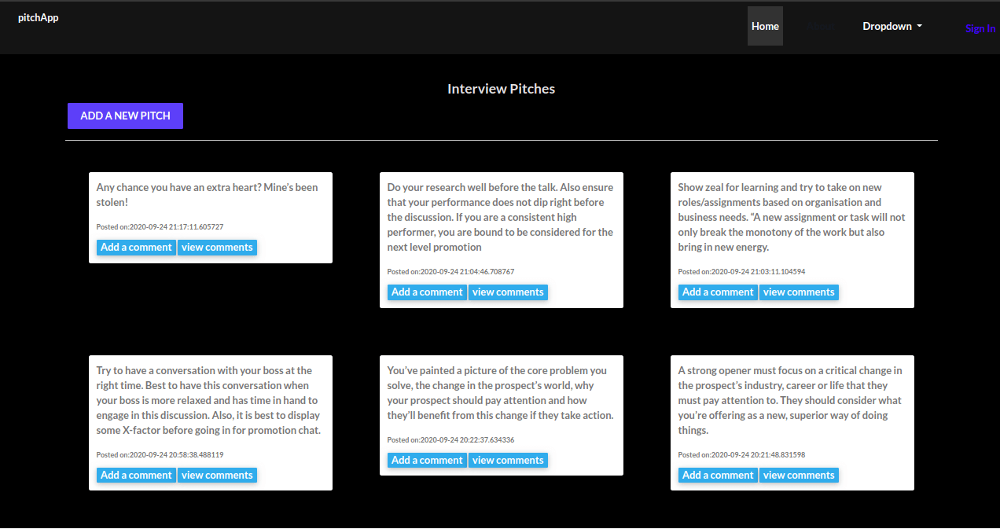

# Pitch App
This is an [application](https://github.com/tomito26/pitchApp.git) where people share pitches to build one another that touches on different sectors of life such as product marketing,interviews,promotions and pick up lines.


## Features
* The app has a navigation bar that makes navigation to different areas easier
* The app has a login  and sign in sections
* The app has input fields  for new  pitches
* The pitches have an upvote and downvote and also comment section
  
## Author 
* Thomas Khaemba

## Set Up and Installation
For one to run this application one needs to install the following technologies:
* Python
* pip


You then copy the project link from github or download the project
If you have  downloaded it ,right click  the mouse and select the  extract/here option and if you have cloned it follow the steps below

You first clone the project
```
$ git clone <repo>
```
Then you  go the project directory/folder 
```
$ cd <project directory/folder>
```
Install the virtual environment and activate it using the following commands
```
$ source <nameofyour virtual env>/bin/activate
```
Then you run the following command to install flask and the project dependencies
```
$ pip install flask
$ pip install -r requirements.txt
```
after that run the following command 
```
$ chmod+x start.sh
```
To launch your project run the following command
```
./start.sh
```
## Technologies Used
* Python
* HTML
* CSS3
* Flask
* Bootstrap
* Posgresql 

## Support and Contact Details
If you run into any challenge or query feel free to reach out tommybwah@gmail.com

## License and Corporation
Licensed under [MIT](license)


